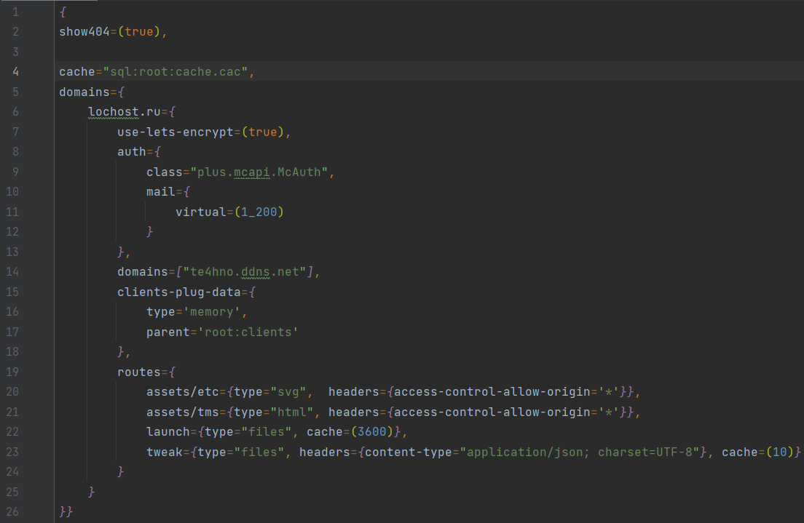
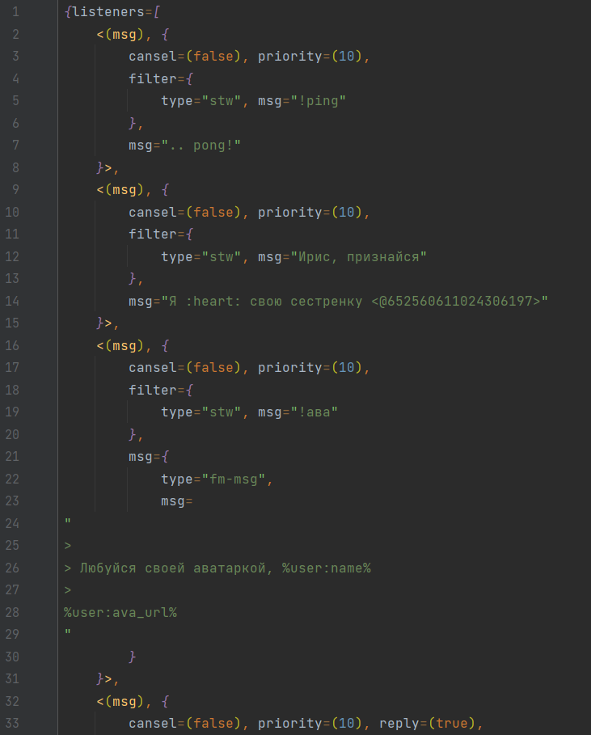

## Простой плагин на поддержку синтаксиса TsonConfigurations в Intelij IDEA

### Примеры внешнего вида и конфигураций в `files`

---

#### Пример 1
> 
> ```json
> {
> show404=(true),
> 
> cache="sql:root:cache.cac",
> domains={
> 	lochost.ru={
> 		use-lets-encrypt=(true),
> 	    auth={
> 			class="plus.mcapi.McAuth",
> 			mail={
> 				virtual=(true)
> 			}
> 		},
> 		domains=["te4hno.ddns.net"],
> 		clients-plug-data={
> 			type='memory',
> 			parent='root:clients'
> 		},
> 		routes={
> 			assets/etc={type="svg",  headers={access-control-allow-origin='*'}},
> 			assets/tms={type="html", headers={access-control-allow-origin='*'}},
> 			launch={type="files", cache=(3600)},
> 			tweak={type="files", headers={content-type="application/json; charset=UTF-8"}, cache=(10)}
> 		}
> 	}
> }}
> ```
> 
> 

#### Пример 2

> 
> ```json
> {listeners=[
> 	<(msg), {
> 		cansel=(false), priority=(10),
> 		filter={
> 			type="stw", msg="!ping"
> 		},
> 		msg=".. pong!"
> 	}>,
> 	<(msg), {
> 		cansel=(false), priority=(10),
> 		filter={
> 			type="stw", msg="Ирис, признайся"
> 		},
> 		msg="Я :heart: свою сестренку <@652560611024306197>"
> 	}>,
> 	<(msg), {
> 		cansel=(false), priority=(10),
> 		filter={
> 			type="stw", msg="!ава"
> 		},
> 		msg={
> 			type="fm-msg",
> 			msg=
> "
> > 
> > Любуйся своей аватаркой, %user:name%
> > 
> %user:ava_url%
> "
> 		}
> 	}>,
> 	<(msg), {
> 		cansel=(false), priority=(10), reply=(true),
> 		filter={
> 			type="start-with", msg="#я люблю техника"
> 		},
> 		msg={
> 			embeds=[{
> 				title="Валькирия %user:name%",
> 				img=["%user:ava_url%", "1024x1024"],
> 				msg="признался(ась) в любви технику"
> 			},{
> 				title="От AIris: ",
> 				msg=
> "
> > 
> > От всей души желаю тебе заполучить
> > ответную любовь от техника
> > *
> "
> 			}]
> 		}
> 	}>
> ]}
> ```
>

---